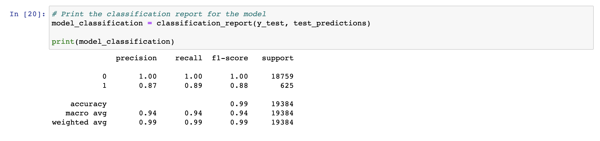
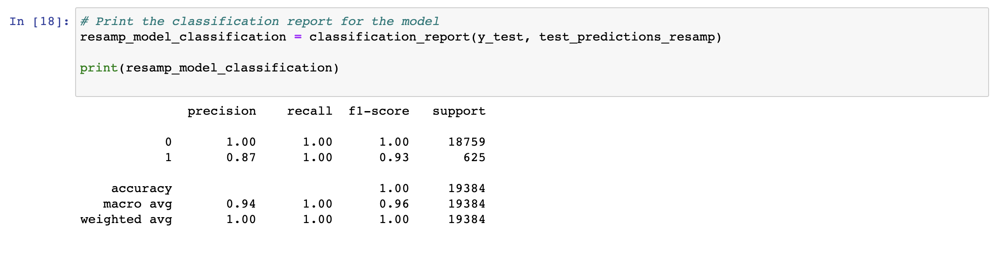
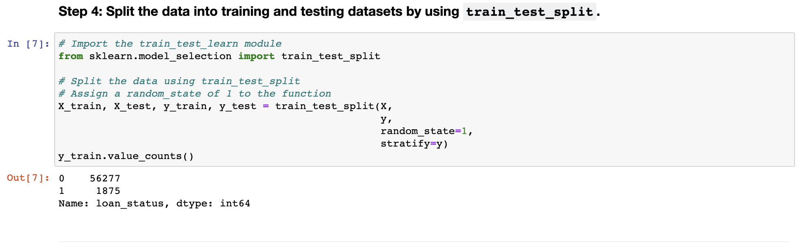
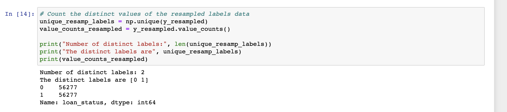

# credit-risk-classification
**Overview:** 
-
This project uses various supervised machine learning techniques to train and evaluate a model based on loan risk. Two models were created to assess the precision, recall and accuracy of identifying 'high-risk loans' from 'healthy' ones. Model one uses the orignal data and model two uses resampled data to balance the previous dataset. 

**Accuracy, Precision, and Recall scores:**
- 
**Model One:**
* *Accuracy:* accuracy for this model was 0.99, balanced accuracy was 0.94
* *Precision:* precision for the healthy-loan (0) class is 1.00 and precision for the high-risk loan class (1) is 0.87
* *Recall:* recall for the healthy-loan (0) class is 1.00 and recall for the high-risk loan class (1) is 0.89

**Model Two:**
* *Accuracy:* accuracy for this model was 1.00, balanced accuracy was 0.996
* *Precision:* precision for the healthy-loan (0) class is 1.00 and precision for the high-risk loan class (1) is 0.87
* *Recall:* recall for the healthy-loan (0) class is 1.00 and recall for the high-risk loan class (1) is 1.00

**Summary:**
-
 Overall, I would reccomend model two over model one because the resampled data showed improved recall and accuracy. We can see that before resampling the data, the data set was quite unbalanced. 

 *before resampling:*
 
 As we can see the value counts are imbalanced, with far more loans being identified as healthy (0) than high-risk(1). 

 *after resampling:*
 
Once the data was balanced, the model produced a high balanced accuracy score, overall accuracy score, and increased recall by about 0.02% for the high-risk loan label. The increased recall in model two did not decrease the precision from the model fitted with orignal data. In summary, this model has high precision, recall, and accuracy, indicating that it is performing well for both healthy and high-risk loan labels. 